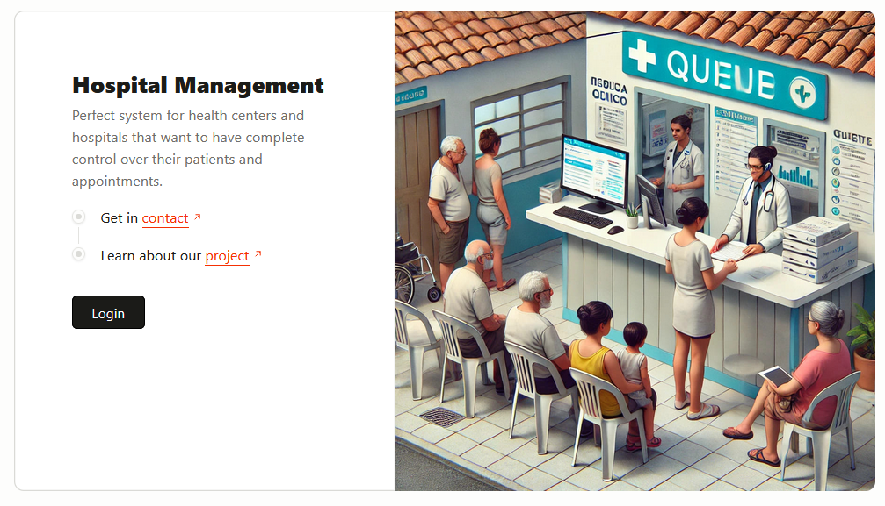
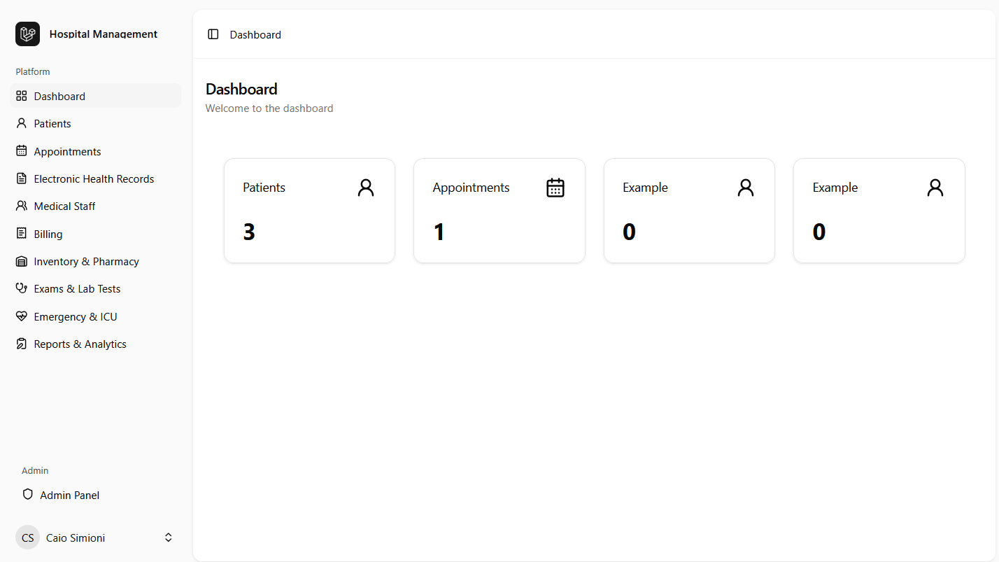

# Open Source Hospital Management System

An open-source hospital management system designed to streamline and optimize hospital operations. This system provides tools for managing patients, scheduling, medical records, staff, finances, inventory, and more.



## Features

This system offers comprehensive tools for patient management, including electronic medical records, appointment scheduling, and treatment tracking. It also supports staff and medical team management with features like shift scheduling, communication tools, and specialty registration. Financial operations are streamlined with billing, insurance management, and financial reporting, while inventory and pharmacy control ensure proper tracking of medications and materials.

Additional features include laboratory and exam management, emergency care tracking, and business intelligence tools for generating reports and dashboards. The system prioritizes security and compliance, offering access control, record auditing, and adherence to regulations like LGPD and HIPAA.

## Installation and Deployment

1. Clone the repository:

   ```bash
   git clone https://github.com/your-repo/pi3-laravel.git
   cd pi3-laravel
   ```

2. Install dependencies:

   ```bash
   composer install --prefer-dist --no-progress --no-suggest --ansi
   npm install
   ```

3. Build assets:

   ```bash
   npm run build
   ```

4. Set up the environment:

   ```bash
   cp .env.example .env
   php artisan key:generate
   ```

5. Configure your database in the `.env` file and run migrations:

   ```bash
   php artisan migrate
   ```

6. Deploy the application:

   - Ensure your server meets the Laravel requirements (PHP 8.2, Node.js 23.x, etc.).
   - Use a web server like Apache or Nginx to serve the application.
   - Point the web server's document root to the `public` directory of the project.

7. Start the development server (optional for local testing):

   ```bash
   php artisan serve
   ```

## Usage

- Access the system at `http://your-domain` or `http://localhost:8000` (for local testing).
- Log in with the default admin credentials (if applicable) or create a new account.



## License

This project is licensed under the [MIT License](LICENSE).

## Contributing

We welcome contributions! Please follow these steps:

1. Fork the repository.
2. Create a new branch for your feature or bugfix:

   ```bash
   git checkout -b feature-name
   ```

3. Commit your changes:

   ```bash
   git commit -m "Description of changes"
   ```

4. Push to your branch:

   ```bash
   git push origin feature-name
   ```

5. Open a pull request.

For major changes, please open an issue first to discuss your ideas.

## Contact

For questions or support, please open an issue or contact the maintainers.
